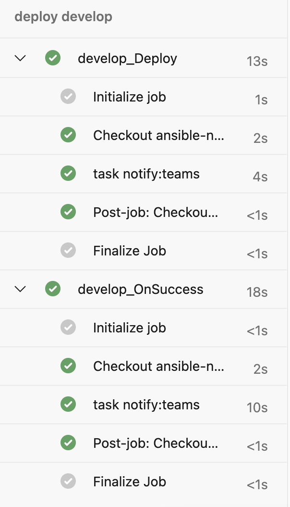

# Introduction 
This is a ansible project for send notifications for a Microsoft Teams channel.
In this project we go return a status of a deployment stage


# Getting Started

## 1. Requirements:

* python

## 2. Install ansible:

```sh
pip install --user ansible
```

[ansible install doc](https://docs.ansible.com/ansible/latest/installation_guide/intro_installation.html)  

## 3. Configure incoming webhooks in Azure Teams:

The Microsoft has a complete doc for this:
    
[Incoming webhooks doc](https://learn.microsoft.com/en-us/microsoftteams/platform/webhooks-and-connectors/how-to/add-incoming-webhook?tabs=dotnet)

Copy the webhook and change value of `teams_webhook` variable in `groups_vaps/main.yml` 

## 4. Understanding project code

### 4.1. Groups Vars

The groups vars serves to keep your constants variables.

In the project we have three variables:

| **variable** | **description** |
|--------:|------------|
| `notify_body` | The lookups return our template that is in a specific path. |
| `teams_webhook` | Webhook created by incoming webhooks in Microsoft Teams |
| `status_image` | Variable dict when return a status images according to current status  |

### 4.2. Inventory

In the inventory file you add the hosts where you run your commands, for this project we will use localhost.

### 4.3. Roles

Roles is a group of a specific context, in our case the notify.

#### 4.3.1. Tasks

This is a core of our code, we added the commands.
We have two tasks:

```yaml
---
- name: Notify | Set Date
  set_fact:
    date: "{{ lookup('pipe', 'date +%d/%m/%Y@%H:%M') }}"
- name: Notify | MS Teams
  uri:
    url: "{{ teams_webhook }}"
    body: "{{ notify_body }}"
    body_format: json
    method: POST
```

The first get a date and set in a variable, you can change the format with:

```yaml
- name: Notify | Set Date
  set_fact:
    date: "{{ lookup('pipe', 'date +%d/%m/%Y@%H:%M') | replace('current','new') }}"
```

The second task use `uri` module of ansible to send the message, for that we need pass the parameters:

| **parameter** | **description** |
|--------:|------------|
| `url` | name of variable that contains the webhook |
| `notify_body` | name of variable that contains the template |
| `body_format` | in this case is json |
| `method` | in this case is POST |

### 4.1.2 Template

The template is a body of notify that we are going to send. The file has the extension .m2, but the content is json.

We use [Adaptive Cards](https://learn.microsoft.com/en-us/adaptive-cards/) for create the body.
You can created your own cards, and customized with the variables. For this, you need add in the body the variables with {{ var_value }}.

This default body has six variables:

| **variable** | **description** |
|--------:|------------|
| `title` | Title of the card |
| `message` | Principal message of the notify card |
| `details` | Details for the user |
| `notify_image` | Variable with image according to current status |
| `date` | Current date setted in first task  |
| `url` | The pipeline url   |

Default body:

```json
{
   "type": "message",
   "attachments": [
      {
         "contentType": "application/vnd.microsoft.card.adaptive",
         "contentUrl": null,
         "content": {
            "type": "AdaptiveCard",
            "body": [
               {
                  "type": "TextBlock",
                  "size": "medium",
                  "weight": "bolder",
                  "text": "{{ title }}"
               },
               {
                  "type": "ColumnSet",
                  "columns": [
                     {
                        "type": "Column",
                        "items": [
                           {
                              "type": "Image",
                              "style": "Person",
                              "url": "{{ notify_image }}",
                              "size": "Small"
                           }
                        ],
                        "width": "auto"
                     },
                     {
                        "type": "Column",
                        "items": [
                           {
                              "type": "TextBlock",
                              "weight": "Bolder",
                              "text": "{{ message }}",
                              "wrap": true,
                              "spacing": "None",
                           },
                           {
                              "type": "TextBlock",
                              "spacing": "None",
                              "text": "{{ date }}",
                              "wrap": true
                           }
                        ],
                        "width": "stretch"
                     }
                  ]
               },
               {
                  "type": "TextBlock",
                  "text": "{{ details }}",
                  "wrap": true,
                  "spacing": "None",
               }
            ],
            "actions": [
               {
                  "type": "Action.OpenUrl",
                  "title": "Visualizar pipeline",
                  "url": "{{ url }}"
               }
            ],
            "$schema": "http://adaptivecards.io/schemas/adaptive-card.json",
            "version": "1.5"
         }
      }
   ]
}
```

## 4.4. Playbook

The playbook file is your main.
For this project we have:

```yaml
---
- hosts: localhost
  connection: local
  gather_facts: false
  collections:
    - ansible.builtin
  vars_files:
    - group_vars/main.yml
  vars:
    title: "{{ title }}"
    message: "{{ message }}"
    details: "{{ details }}"
    status: "{{ status }}"
    url: "{{ url }}"
    notify_image: '{{ status_image[status | default("this key does not exist in the dict")] | default("") }}'
  roles:
    - role: notify
```

when:
| **variable** | **description** |
|--------:|------------|
| `hosts` | In which host will run the tasks |
| `connection` | Kind of connection, when we use localhost, need to be local |
| `getter_facts` | Get facts of the host, for example the current hour, but for this project we use false because, true have problems in localhost |
| `collections` | Librarys of ansible that we will use, in this case just `ansible.builtin`  |
| `vars_files` | path of group_vars  |
| `vars` | input variables, notify_image get a image from the status_image dict variable |
| `roles` | group we will use, in this case `notify`  |

# 5. Running

## 5.1 command

For running the tasks it is necessary to call:

```sh
ansible-playbook playbook.yml \
    -i "inventory/inventory" \
    --extra-vars='title="$TITLE" \
    message="$MESSAGE" \
    details="$DETAILS" \
    status=$STATUS \
    url=$URL'
```

When -i is the inventory path and extra-vars is a input variables.

## 5.2 Usage examples

Azure Devops: `.azuredevops/pipeline.yml`



Github Actions : `.github/workflow/pipeline.yml`